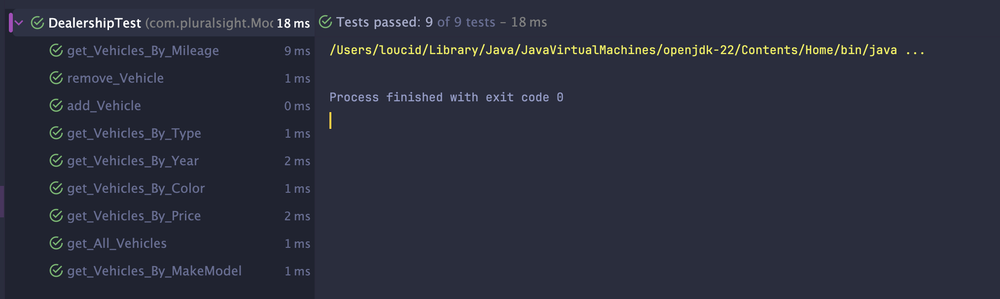

# CarDealership Documentation

## Table of Contents
> 1. [Introduction](#Introduction)
> 2. [UML Diagram](#UML-Diagram)
> 3. [Structure](#Structure)
> 4. [Example Code](#Example-Code)
> 5. [Unit Tests](#Example-Unit-Tests)
> 6. [Outcomes](#Outcomes)

## Introduction

## UML Diagram

## Structure

## Example Code
```java
// code


```
## Example Unit Tests
I wanted to create a Unit Test for this project, as we learned how to do so earlier in the week.
One of the examples I had done is for the Dealership Class --> DealershipTests.java
```java
@Test
public void get_Vehicles_By_Price() {
    // arrange - setup
    Dealership dealership = new Dealership("Test Dealership", "123 Test Ave", "555-555-5555");
    dealership.addVehicle(vehicle1);
    dealership.addVehicle(vehicle2);
    dealership.addVehicle(vehicle3);
    dealership.addVehicle(vehicle4);
    dealership.addVehicle(vehicle5);

    // act --> THE ONE action that I am testing
    List<Vehicle> filteredActual = dealership.getVehiclesByPrice(5000, 10000);
    
    // assert - verify that the action worked as expected
    List<Vehicle> filteredExpected = List.of(vehicle1, vehicle2, vehicle3);
    String message = "Price" + " Search Error";
    assertEquals(message, filteredExpected, filteredActual);
}
```
`arrange - setup` - This creates a new `Dealership` object and adds a bunch of `final Vehicle` 
objects into the Array List found inside `Dealership`. 

`act` - This creates a filtered List of Vehicles is returned from the `getVehiclesByPrice()` method.

`assert` - This creates what is expected and compares the expected list and actual list.

## Outcomes
### Unit Tests

All unit tests passed
### Project
