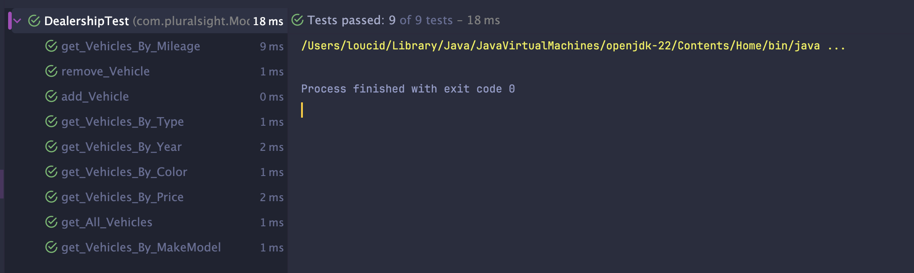
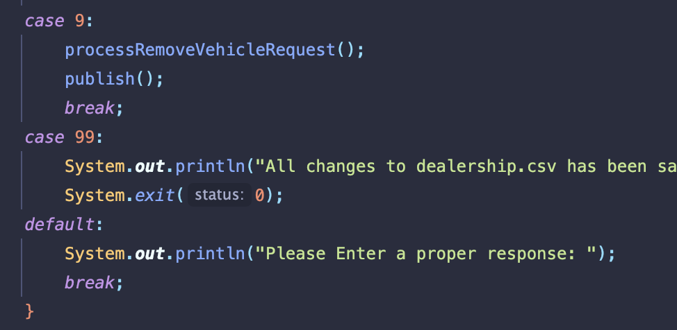

# CarDealership Documentation
## Table of Contents
> 1. [Introduction](#Introduction)
> 2. [UML Diagram](#UML-Diagram)
> 3. [Structure](#Structure)
> 4. [Example Code](#Example-Code)
> 5. [Unit Tests](#Example-Unit-Tests)
> 6. [Outcomes](#Outcomes)
## Introduction
This project was to create a program that holds information about a Car Dealership. It handles all adding and removing of vehicles
in the dealership, as well as allow users to search for vehicles in the dealership by different categories! All information is 
stored in both a List and a .csv file.
## UML Diagram

This is my basic planning for the project in Diagram form
## Structure
### Main
This class just utilizes the CarDealership.run() method to start the application.
### CarDealership
This class creates a new instance of the UserInterface class and calls the userInterface.display method
### UserInterface
This creates a new instance of the Dealership class, initializes the dealership with the dealership.csv by calling the DealershipFileManager
class. This class also handles user input to process search requests, add/remove requests, and saves it to the dealership.csv file.
### DealershipFilManager
This handles all reading and writing of the csv file. 
### Dealership
This handles all the searches, the CRUD, and the list of vehicles. A unit test was created to test everything here.
### Vehicle
This handles storing all information of a single vehicle.
## Example Code
```java
public List<Vehicle> getVehiclesByPrice(double min, double max) {
    return inventory.stream()
            .filter(vehicle -> vehicle.getPrice() >= min)
            .filter(vehicle -> vehicle.getPrice() <= max)
            .toList();
}
```
This code takes the `ArrayList<Vehicle> inventory` and filters it to only show Vehicles between the min
and max prices to be searched. It utilizes `stream().filter` to only return vehicles that follow the correct
range. I love how its such an efficient code to return a list. If it were another way it would utilize a lot of loops and if/else statements
## Example Unit Tests
I wanted to create a Unit Test for this project, as we learned how to do so earlier in the week.
One of the examples I had done is for the Dealership Class --> DealershipTests.java
```java
@Test
public void get_Vehicles_By_Price() {
    // arrange - setup
    Dealership dealership = new Dealership("Test Dealership", "123 Test Ave", "555-555-5555");
    dealership.addVehicle(vehicle1);
    dealership.addVehicle(vehicle2);
    dealership.addVehicle(vehicle3);
    dealership.addVehicle(vehicle4);
    dealership.addVehicle(vehicle5);

    // act --> THE ONE action that I am testing
    List<Vehicle> filteredActual = dealership.getVehiclesByPrice(5000, 10000);
    
    // assert - verify that the action worked as expected
    List<Vehicle> filteredExpected = List.of(vehicle1, vehicle2, vehicle3);
    String message = "Price" + " Search Error";
    assertEquals(message, filteredExpected, filteredActual);
}
```
`arrange - setup` - This creates a new `Dealership` object and adds a bunch of `final Vehicle` 
objects into the Array List found inside `Dealership`. 

`act` - This creates a filtered List of Vehicles is returned from the `getVehiclesByPrice()` method.

`assert` - This creates what is expected and compares the expected list and actual list.
## Outcomes
### Unit Tests

All unit tests passed
### Project
These are just some examples of how the program runs

The addVehicle method

The removeVehicle method

When these methods (add/remove) are called, they are added to dealership Array List then the dealership.csv file.


The getVehiclesByColor Method


Error shows improper integer input. Tells user to input a correct response.

Uses the default case in the Switch so anything other than 1-9 and 99 shows incorrect response.

Error shows improper input. Tells user to input a correct response.

Uses Try/Catch to handle if anything other than an integer was used.
